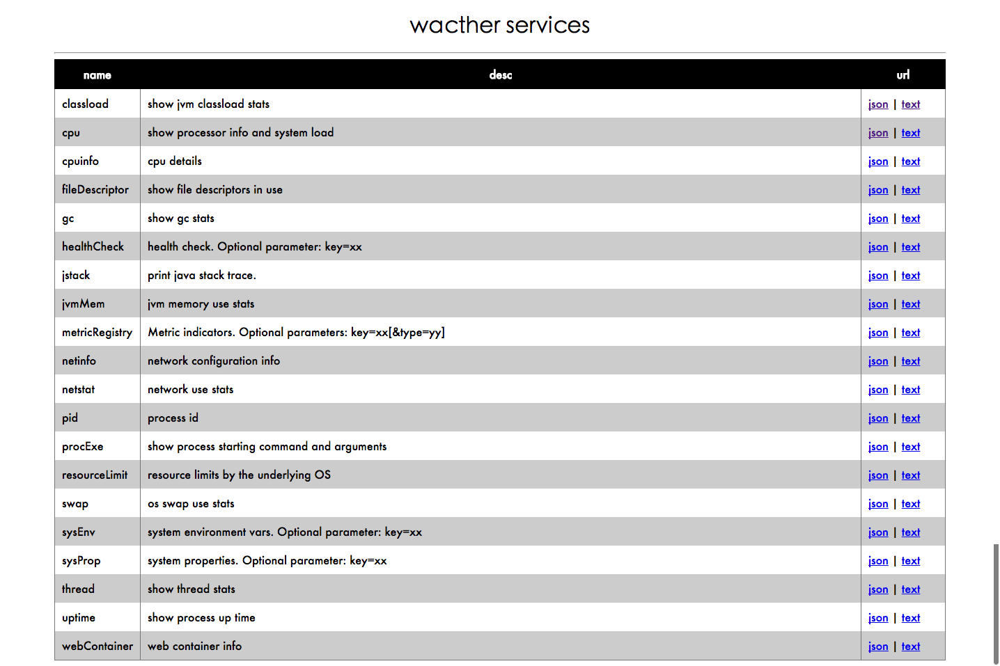
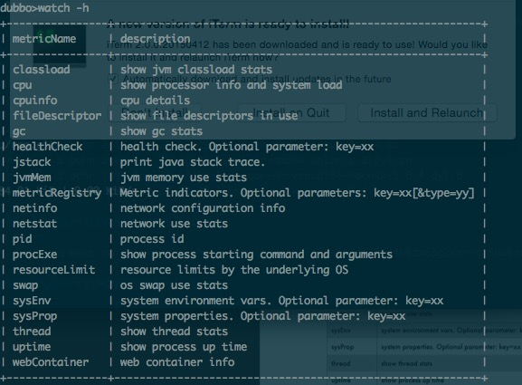

## watcher
**watcher**(守望者)提供监控系统/jvm的能力。应用使用它，可以把相关的指标暴露出来，目前支持`http`和`dubbo`两种方式暴露监控指标。


## 1. showcase

### 1.1 http
首页:



例如查看thread，访问`http://127.0.0.1:11111/watcher/q.do?action=thread`返回:

	{
    	"success":true,
    	"appName":"test",
    	"data":{
    		"deadlockedThreadsCount":0,
    		"threadCount":24,
    		"totalStartedThreadCount":264,
    		"peakThreadCount":24,
    		"daemonThreadCount":23,
    		"deadlockedThreads":[]
    	}
    }
    
### 1.2 dubbo

连接dubbo端口并且执行监控命令:

	telnet 127.0.0.1 20880
	watch -h



查看thread,输入:

	watch thread

返回：
```JSON
	{
    	"success":true,
    	"appName":"test",
    	"data":{
    		"deadlockedThreadsCount":0,
    		"threadCount":24,
    		"totalStartedThreadCount":264,
    		"peakThreadCount":24,
    		"daemonThreadCount":23,
    		"deadlockedThreads":[]
    	}
    }
```

## 2. 如何使用

### 2.1 模块介绍
watcher提供了下面几个模块：

* watcher-core

	watcher核心功能模块
	
* watcher-dubbo

	提供dubbo相关的监控、健康检查，并提供`com.yiji.framework.watcher.dubbo.adaptor.telnet.WatcherTelnetHandler`暴露数据
	
* watcher-spring

	spring的相关组件监控、健康检查能力。使用此模块时，需要把`com.yiji.framework.watcher.spring.SpringApplicationContextHolder`配置到spring容器内，watcher扩展会通过此类获取到spring `ApplicationContext`

* watcher-http

	提供tomcat容器的监控能力，并提供`com.yiji.framework.watcher.http.adaptor.web.WatcherServlet`用于暴露数据

* watcher

	此模块仅用于依赖，他依赖了上面所有的module

### 2.2 依赖：

使用所有功能，请依赖：
	
    <dependency>
        <groupId>com.yiji.framework</groupId>
        <artifactId>watcher</artifactId>
        <version>1.5.2</version>
    </dependency>

仅仅使用部分功能，比如只依赖http:

    <dependency>
     		<groupId>com.yiji.framework</groupId>
        	<artifactId>watcher-http</artifactId>
        	<version>1.5.2</version>
    </dependency>
	
### 2.3 web应用配置：

#### 2.3.1 配置web.xml
	 
	<servlet>
        <servlet-name>WatcherServlet</servlet-name>
        <servlet-class>com.yiji.framework.watcher.http.adaptor.web.WatcherServlet</servlet-class>
        <init-param>
               <param-name>watcher.app.name</param-name>
               <param-value>xxxx</param-value>
        </init-param>
    </servlet>
    <servlet-mapping>
        <servlet-name>WatcherServlet</servlet-name>
        <url-pattern>/watcher/*</url-pattern>
    </servlet-mapping>

参数`watcher.app.name`为系统名称

#### 2.3.2 servlet 3.0 java编程式配置

	WatcherServlet watcherServlet = new WatcherServlet("test");
	ServletRegistration.Dynamic servletRegistration = servletContext.addServlet("watcherServlet", watcherServlet);
			servletRegistration.addMapping("/watcher/*");
    
### 2.4 dubbo应用配置：
 
 	<dubbo:provider timeout="60000" cluster="failfast" telnet="watch"/>
	
在`dubbo:provider`上的`telnet`加`watch`

## 3. 快速体验

下载源代码后导入IDE，执行`com.yiji.framework.boot.WatherTomcatBootStrap`类，控制台会输出如下的提示，`http`端口11111，dubbo服务端口`20880`

	应用启动成功,耗时:5235ms
	web: http://127.0.0.1:11111/watcher/
	dubbo: telnet 127.0.0.1 20880
	您可以直接在console里输入回车重启应用

## 4. 提供的监控能力

	+-----------------------+---------------------------------------------------+	
	| metricName            | description                                       |	
	+-----------------------+---------------------------------------------------+	
	| busyJavaThread        | show busy java thread,Optional parameters:count=10,default 	count=5 |
	| classload             | show jvm classload stats                          |
	| cpu                   | show processor info and system load               |
	| cpuinfo               | cpu details                                       |
	| datasource            | datasource                                        |
	| df                    | filesystem disk space usage                       |
	| dubboRegistryStatus   | dubbo registry status                             |
	| dubboServerStatus     | dubbo server status                               |
	| dubboThreadPoolStatus | dubbo thread pool status                          |
	| fileDescriptor        | show file descriptors in use                      |
	| gc                    | show gc stats                                     |
	| healthCheck           | health check. Optional parameter: key=xx          |
	| iostat                | io usage                                          |
	| jstack                | print java stack trace.                           |
	| jvmMem                | jvm memory use stats                              |
	| metricRegistry        | Metric indicators. Optional parameters: key=xx[&type=yy] |
	| netinfo               | network configuration info                        |
	| netstat               | network use stats                                 |
	| osVersion             | os version info                                   |
	| pid                   | process id                                        |
	| procExe               | show process starting command and arguments       |
	| swap                  | os swap use stats                                 |
	| sysEnv                | system environment vars. Optional parameter: key=xx |
	| sysProp               | system properties. Optional parameter: key=xx     |
	| thread                | show thread stats                                 |
	| ulimit                | system resource limits,h/help show help           |
	| uptime                | show process up time                              |
	| webContainer          | web container info                                |
	+-----------------------+---------------------------------------------------+

操作系统相关的信息，通过[sigar](https://github.com/hyperic/sigar)获取,sigar不支持window,window下某些监控数据获取不到。

## 5. 如何添加监控插件

`watcher`提供了通过`metrics`来添加监控指标。当然也可以通过`watcher`的方式来添加监控指标。

### 5.1 `metircs style`
watcher内部集成了[metrics](https://github.com/dropwizard/metrics),需要添加自己的指标也可以通过metircs的方式来。这里需要使用`com.yiji.framework.watcher.MetricsHolder`来获取`MetricRegistry`或者`HealthCheckRegistry`.

当然，您的核心公共库(方便其他组件添加指标)不想依赖`watcher`，也没有关系(其实我们也有这样的问题)，`MetricsHolder`内部使用的`SharedMetricRegistries`,您只需要在您的核心公共库中保证名字相同就ok。

访问时，通过`metricName=metricRegistry`来访问MetricRegistry，通过`metricName=healthCheck`来访问监控检查。

### 5.2 `watcher style`

`watcher`提供了集中添加监控指标插件的方式，您的扩展需要继承`AbstractCachedWatcherMetrics`，然后:

#### 5.2.1 `watcher`自动扫描包

`DefaultWatcherService`默认会扫描`com.yiji.framework.watcher`包下所有实现`WatcherMetrics`接口的类.

您也可以把实现类放在`com.yiji.framework.watcher`包中，`watcher`会自动帮您添加到`com.yiji.framework.watcher.extension.ExtensionRepository`中。

#### 5.2.2 Java SPI
您也可以通过标准的Java SPI机制来添加您的插件，在您的类路径下新建文件`META-INFO/services/com.yiji.framework.watcher.WatcherMetrics`,在文件中写入实现类类名。

java spi参考地址：[Introduction to the Service Provider Interfaces](https://docs.oracle.com/javase/tutorial/sound/SPI-intro.html)


#### 5.2.3 编程式添加插件
`DefaultWatcherService`类是单例的，并且实现了`ExtensionRepository`接口。所以您可以
通过`DefaultWatcherService.INSTANCE#add`注册自己开发的监控指标。

## 6. 如何添加健康检查插件

添加健康检查插件的方式和上节提到的方式类似，您的扩展需要继承`com.codahale.metrics.health.HealthCheck`,然后：

1. 通过metric `HealthCheckRegistry`添加
2. 通过 `watcher`自动扫描，扫描包为`com.yiji.framework.watcher`,继承`com.codahale.metrics.health.HealthCheck`的类
3. 通过Java SPI机制，在`META-INFO/services/com.codahale.metrics.health.HealthCheck`中加入实现类。


## 7.FAQ

### 7.1 访问控制

`watcher`中的`WatcherServlet`提供了访问控制能力,默认只允许内网访问，详情见`AccessControlServlet`代码注释。

### 7.2 watcher会对性能造成影响吗？

基本上不会，那些会对性能造成影响的扩展，我们都加上了缓存。而且大多数扩展不会介入业务的运行，不会对业务的执行造成影响。

### 7.3 watcher内置了哪些扩展？

	com.yiji.framework.watcher.dubbo.metrics.DubboRegistryStatusMetrics
	com.yiji.framework.watcher.dubbo.metrics.DubboServerStatusMetrics
	com.yiji.framework.watcher.dubbo.metrics.DubboThreadPoolStatusMetrics
	com.yiji.framework.watcher.http.metrics.WebContainerMetrics
	com.yiji.framework.watcher.metrics.ClassloadMetrics
	com.yiji.framework.watcher.metrics.CpuMetrics
	com.yiji.framework.watcher.metrics.FileDescriptorMetrics
	com.yiji.framework.watcher.metrics.GCMetrics
	com.yiji.framework.watcher.dubbo.health.DubboRegistryStatusHealthCheck
	com.yiji.framework.watcher.dubbo.health.DubboServerStatusHealthCheck
	com.yiji.framework.watcher.dubbo.health.DubboThreadPoolStatusHealthCheck
	com.yiji.framework.watcher.health.MemoryStatusHealthCheck
	com.yiji.framework.watcher.health.SystemLoadHealthCheck
	com.yiji.framework.watcher.health.ThreadDeadlockHealthCheck
	com.yiji.framework.watcher.spring.health.DataSourceStatusHealthCheck
	com.yiji.framework.watcher.spring.health.SpringStatusHealthCheck
	com.yiji.framework.watcher.metrics.HealthCheckMetrics
	com.yiji.framework.watcher.metrics.JstackMetrics
	com.yiji.framework.watcher.metrics.JvmMemMetrics
	com.yiji.framework.watcher.metrics.MetricRegistryMetrics
	com.yiji.framework.watcher.metrics.PidMetrics
	com.yiji.framework.watcher.metrics.SysEnvMetrics
	com.yiji.framework.watcher.metrics.SysPropMetrics
	com.yiji.framework.watcher.metrics.TestShellMetrics
	com.yiji.framework.watcher.metrics.ThreadMetrics
	com.yiji.framework.watcher.metrics.UptimeMetrics
	com.yiji.framework.watcher.metrics.os.CpuInfoMetrics
	com.yiji.framework.watcher.metrics.os.DfMetircs
	com.yiji.framework.watcher.metrics.os.IostatMetircs
	com.yiji.framework.watcher.metrics.os.NetInfoMetrics
	com.yiji.framework.watcher.metrics.os.NetStatMetrics
	com.yiji.framework.watcher.metrics.os.OsVersionMetircs
	com.yiji.framework.watcher.metrics.os.ProcExeMetrics
	com.yiji.framework.watcher.metrics.os.SwapMetrics
	com.yiji.framework.watcher.metrics.os.UlimitMetircs
	com.yiji.framework.watcher.metrics.shell.BusyJavaThreadMetrics
	com.yiji.framework.watcher.spring.metrics.DataSourceMetics
	
### 7.4 我开发了某个组件的watcher 健康检查扩展，如何在没有使用此组件的时候健康检查不启用？

可以参考下`com.yiji.framework.watcher.dubbo.health.DubboRegistryStatusHealthCheck`，他在构造器内调用：

            Utils.checkClassExists("com.alibaba.dubbo.registry.support.AbstractRegistryFactory", "dubbo");

检查是否有dubbo的依赖。如果没有此依赖，扩展加载器`com.yiji.framework.watcher.extension.ExtensionLoader`不会加载此健康检查扩展。
